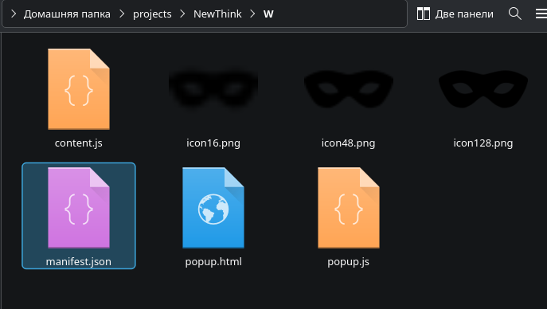
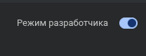
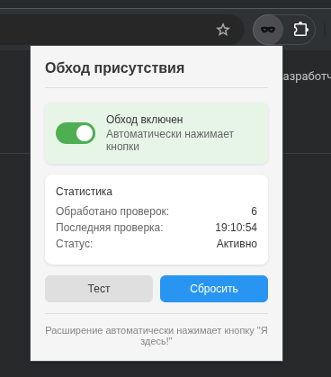

# I`m here

## Быстрый гайд по установке

### 1 - Скачать последний релиз и распаковать в любую удобную папку

### 2 - Зайти на [сайт](chrome://extensions/)
chrome://extensions/

### 3 - Включить режим разработчика в правом верхнем углу

### 4 - Нажить на кнопку в левом верхнем углу "Загрузить распакованное расширение" и указать путь к папке из 1-го пункта. 

### 5 - Включить расширение в меню расширений

## После установки убедительная просьба поставить звезду на репозиторий

